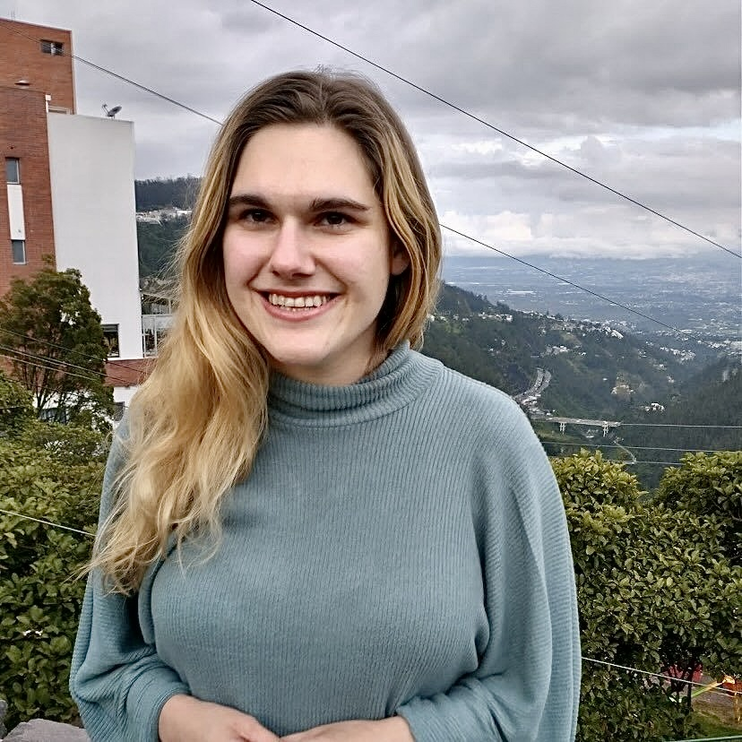
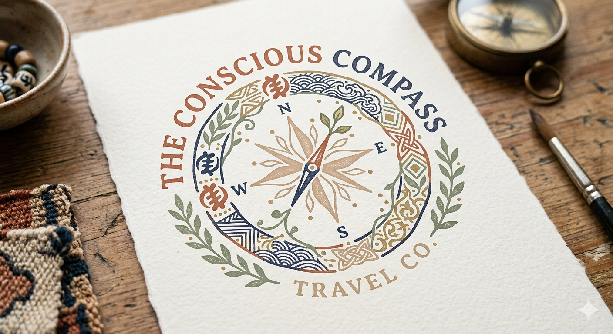

<html lang="en">
<head>
    <meta charset="UTF-8">
    <meta name="viewport" content="width=device-width, initial-scale=1.0">
    <title>The Conscious Compass Travel Co.</title>
    <!-- Tailwind CSS for modern, responsive layout styling -->
    
    <link href="https://fonts.googleapis.com/css2?family=Playfair+Display:ital,wght@0,400..900;1,400..900&family=Plus+Jakarta+Sans:ital,wght@0,200..800;1,200..800&display=swap" rel="stylesheet">
    
</head>
<body class="min-h-screen flex flex-col justify-between selection:bg-stone-200 relative overflow-x-hidden">

    <!-- Layered Watercolor Displacement Filter for Hand-Painted Hummingbird Aesthetics -->
    <svg class="hidden">
        <defs>
            <filter id="watercolor-displacement">
                <feTurbulence type="fractalNoise" baseFrequency="0.04" numOctaves="3" result="noise" />
                <feDisplacementMap in="SourceGraphic" in2="noise" scale="7" xChannelSelector="R" yChannelSelector="G" />
            </filter>
        </defs>
    </svg>

    <!-- Interactive Custom Watercolor Violet-Eared Hummingbird Asset -->
    

        <svg id="hummingbird-svg" viewBox="0 0 160 120" class="w-full h-full drop-shadow-sm filter" style="filter: url(#watercolor-displacement); transform-origin: 88px 50px;">
            <!-- Soft Watercolor Translucent Gradients -->
            <defs>
                <linearGradient id="body-grad" x1="0%" y1="0%" x2="100%" y2="100%">
                    <stop offset="0%" stop-color="#4E5142" stop-opacity="0.85" />
                    <stop offset="40%" stop-color="#8C7A6B" stop-opacity="0.9" />
                    <stop offset="80%" stop-color="#3D4035" stop-opacity="0.8" />
                </linearGradient>
                <linearGradient id="wing-grad" x1="0%" y1="0%" x2="100%" y2="100%">
                    <stop offset="0%" stop-color="#3D4035" stop-opacity="0.65" />
                    <stop offset="60%" stop-color="#4E5142" stop-opacity="0.75" />
                    <stop offset="100%" stop-color="#8C7A6B" stop-opacity="0.55" />
                </linearGradient>
            </defs>
            
            <!-- Long Slender Hummingbird Beak -->
            <path d="M 10 38 Q 45 42 75 42" stroke="#2C302E" stroke-width="1.5" stroke-linecap="round" fill="none" />
            
            <!-- Swept-back Layered Tail Feathers -->
            <path d="M 65 82 C 50 95 30 105 15 110 C 35 98 50 88 58 80 Z" fill="url(#body-grad)" />
            <path d="M 62 82 C 45 100 25 112 8 116 C 28 102 45 92 54 81 Z" fill="url(#body-grad)" class="opacity-80" />

            <!-- Underwing (Anatomical Flutter Action Layer) -->
            <g id="underwing" style="transform-origin: 88px 50px;">
                <path d="M 88 50 C 100 20 115 -10 130 -15 C 120 10 105 30 88 50 Z" fill="url(--wing-grad)" />
            </g>

            <!-- Anatomical Body Contour (Sleek throat, swelling chest & slender belly) -->
            <path d="M 75 42 Q 85 35 92 40 C 105 48 108 65 98 75 C 88 85 75 88 65 82 C 55 76 50 62 58 52 C 64 44 80 40 92 40 Z" fill="url(#body-grad)" />
            
            <!-- Tiny Delicate Eye -->
            <circle cx="82" cy="38" r="1.5" fill="#2C302E" />

            <!-- Overwing (Anatomical Flutter Action Layer) -->
            <g id="overwing" style="transform-origin: 88px 50px;">
                <path d="M 88 50 C 110 15 135 -15 155 -25 C 135 15 110 40 88 50 Z" fill="url(#wing-grad)" />
            </g>
        </svg>
    

    <!-- Elegant Text Branding -->
    <header class="py-10 px-4 text-center max-w-4xl mx-auto">
        <h1 class="text-3xl md:text-5xl font-semibold tracking-widest text-[#3D4035] uppercase">
            The Conscious Compass
        </h1>
        <!-- High Impact Placement: Core Sub-Headline Positioning Statement -->
        

            For the conscious traveler.
        

        

            Travel Co. • Intentionally Curated Journeys
        

    </header>

    <main class="w-full max-w-4xl mx-auto px-4 pb-20 flex-grow">
        
        <!-- Landscape Watercolor Banner Block -->
        

            
            
            <!-- Safe Fallback: If landscape.jpg is missing, load a moody rainforest canopy -->
            
        

        <!-- Section 1: Expandable "Meet Your Travel Architect" Intro -->
        <section class="max-w-4xl mx-auto mb-16 bg-white/40 border border-stone-200/40 rounded-3xl p-6 md:p-10 shadow-sm">
            

                The Curator
                <h2 class="text-3xl font-medium text-[#3D4035] mt-2 mb-6">Meet Your Travel Architect</h2>
            

            
            

                <!-- Hook Paragraph: Always Visible -->
                

                    An exceptional travel experience is born from the tension between raw adventure and meticulous design. It requires a planner who looks past generic, glossy brochures and instead understands how to read a landscape, decode unpredictable infrastructure, and engage intentionally with local community networks.
                

                
                <!-- Expandable Deep-Dive Split Grid Panel -->
                

                    

                        <!-- Left Column: Biography Narrative -->
                        

                            

                                My career has been defined by the art of <strong class="text-[#3D4035] font-semibold">curation</strong>. As a multidisciplinary artist and educator, I have spent years exploring the intersection of visual storytelling, global connectivity, and geographic navigation. In the art world, curation is about selecting, organizing, and presenting elements to tell a profound, cohesive story. In high-end travel design, I apply that exact same artistic lens. I do not just book trips; I curate immersive, sensory, and highly intentional environments for you to experience.
                            

                            

                                My design philosophy is built from firsthand, real-world experience navigating diverse international terrains—from the dense canopy systems of Central America to complex, transit-heavy urban landscapes. Having mapped out and executed deep-dive family travels and eco-conscious expeditions across the globe, I launched <strong class="text-[#3D4035] font-semibold">The Conscious Compass Travel Co.</strong> to provide travelers with an entirely new standard of travel intelligence.
                            

                            

                                I specialize in translating complex international logistics, regional transit systems, and intricate cultural topographies into a singular, beautifully curated blueprint. My focus is entirely on slow, sustainable, and eco-conscious travel—crafting journeys that honor the ecosystems we visit while protecting the absolute safety, structural comfort, and culinary needs of your travel party. I don't just tell you where to go; I give you the complete spatial awareness, transit protocols, and expertly curated neighborhood insights you need to experience a destination with complete, unwavering confidence.
                            

                            

                                Let’s step away from the endless planning loops and curate your next masterpiece.
                            

                        

                        
                        <!-- Right Column: Portrait and Stationery Logo Stacking Grid -->
                        

                            <!-- Portrait Frame -->
                            

                                
                            

                            <!-- Logo Frame (Clean and direct reference to Logo.jpg) -->
                            

                                
                            

                            
                        

                    

                

                
                <!-- Interactive Toggle Button -->
                

                    <button id="about-toggle-btn" onclick="toggleAbout()" class="inline-flex items-center gap-2 text-xs font-semibold tracking-wider uppercase text-[#8C7A6B] hover:text-[#3D4035] border-b border-[#8C7A6B] pb-1 transition-colors focus:outline-none">
                        Read My Full Story
                        <svg id="about-toggle-icon" class="w-3 h-3 transform transition-transform duration-200 text-[#8C7A6B]" fill="none" stroke="currentColor" stroke-width="2" viewBox="0 0 24 24">
                            <path stroke-linecap="round" stroke-linejoin="round" d="M19 9l-7 7-7-7"></path>
                        </svg>
                    </button>
                

            

        </section>

        

        <!-- Section 2: Restructured Horizontal Service Tiers -->
        <section class="mb-20 max-w-4xl mx-auto">
            

                Services & Blueprints
                <h2 class="text-3xl md:text-4xl font-medium text-[#3D4035] mt-2">The Three Curated Tiers</h2>
                
Choose the level of design, scaffolding, and support your journey requires.

            

            

                <!-- Tier 1: Horizontal Framework Layout -->
                

                    <!-- Left Column Anchor -->
                    

                        

                            Tier 1
                            <h3 class="text-lg font-bold text-[#3D4035] mt-1 leading-snug">The Deep-Dive Research Blueprint</h3>
                            
$175 / focus topic

                        

                        <a href="#discover" class="block text-center mt-6 bg-stone-100 hover:bg-stone-200 text-[#3D4035] font-semibold text-xs py-3 rounded-xl transition">
                            Select Blueprint ➔
                        </a>
                    

                    <!-- Right Column Spaced Content -->
                    

                        
<strong class="text-stone-800 font-semibold">Perfect For:</strong> The confident DIY traveler or anxious planner who loves booking their own trips but wants an expert to eliminate the stress of logistics, safety, or complex international entry requirements.

                        
<strong class="text-stone-800 font-semibold">What You Receive:</strong> A highly organized, comprehensive custom PDF document focusing entirely on what is keeping you up at night.

                        
                        

                            Included Deliverables:
                            

                                
🗺️ <strong class="text-stone-800">Custom Logistics Map:</strong> Step-by-step public transit breakdowns, train routing, or private transit options.

                                
🛂 <strong class="text-stone-800">Bureaucracy Guide:</strong> Up-to-date visa checkpoints, digital landing forms, and entry immunization protocols.

                                
🛡️ <strong class="text-stone-800">Safety Briefing:</strong> Neighborhood security maps, active regional scams to avoid, and emergency contact points.

                                
📋 <strong class="text-stone-800">Packing Checklists:</strong> Tailored gear profiles for your destination's explicit topography or micro-climate.

                            

                        

                    

                

                <!-- Tier 2: Horizontal Framework Layout -->
                

                    <!-- Left Column Anchor -->
                    

                        

                            Tier 2
                            <h3 class="text-lg font-bold text-[#3D4035] mt-1 leading-snug">The "Day-Hacker" Partial Itinerary</h3>
                            
$75 / planned day

                            
*Minimum of 2 days required

                        

                        <a href="#discover" class="block text-center mt-6 bg-stone-100 hover:bg-stone-200 text-[#3D4035] font-semibold text-xs py-3 rounded-xl transition">
                            Select Day-Hacker ➔
                        </a>
                    

                    <!-- Right Column Spaced Content -->
                    

                        
<strong class="text-stone-800 font-semibold">Perfect For:</strong> Travelers who have 70% of their trip figured out but are completely stuck on how to maximize a specific multi-day stretch, handle a complex transit day, or curate a flawless hidden-gem experience.

                        
<strong class="text-stone-800 font-semibold">What You Receive:</strong> Seamless, hourly time-blocked execution blueprints for the specific dates requested, designed to plug directly into your existing calendar.

                        
                        

                            Included Deliverables:
                            

                                
⏱️ <strong class="text-stone-800">Optimized Flow:</strong> Minute-by-minute or block pacing to eliminate city crisscrossing bottlenecks.

                                
🍽️ <strong class="text-stone-800">Curated Culinary Matches:</strong> Hidden local dining markers and market walking loops mapped for those specific dates.

                                
📍 <strong class="text-stone-800">"Getting There" Blueprint:</strong> Explicit transfer directives, platform codes, and link connections.

                            

                        

                    

                

                <!-- Tier 3: Horizontal Framework Layout (Flagship Row Highlight) -->
                

                    

                        Flagship Service
                    

                    <!-- Left Column Anchor -->
                    

                        

                            Tier 3
                            <h3 class="text-lg font-bold text-[#3D4035] mt-1 leading-snug">The All-Inclusive Custom Retainer</h3>
                            
                            

                                
$450 / 1–7 Day Trip

                                
$750 / 8–14 Day Journey

                                
Trips 15+ days customized on request

                            

                        

                        <a href="#discover" class="block text-center mt-6 bg-[#4E5142] hover:bg-[#3D4035] text-white font-semibold text-xs py-3 rounded-xl transition shadow-xs">
                            Retain Travel Architect ➔
                        </a>
                    

                    <!-- Right Column Spaced Content -->
                    

                        
<strong class="text-stone-800 font-semibold">Perfect For:</strong> The busy traveler who wants a flawless, deeply intentional international vacation from start to finish without spending 40 hours staring at travel forums and cross-referencing maps.

                        
<strong class="text-stone-800 font-semibold">What You Receive:</strong> A complete, beautifully mapped, comprehensive end-to-end travel blueprint.

                        
                        

                            Included Deliverables:
                            

                                
✨ <strong class="text-stone-800">The Signature Blueprint:</strong> Comprehensive multi-page master document matching Tiers 1 and 2 for the entire duration.

                                
🏨 <strong class="text-stone-800">Accommodation Shortlists:</strong> 2–3 hand-selected, verified independent boutique lodging matches with link anchors.

                                
🔄 <strong class="text-stone-800">Two Revision Rounds:</strong> Collaborative aesthetic adjustments to tweak pace and environmental balance.

                                
🎁 <strong class="text-stone-800">Complimentary Travel Print:</strong> Choose any signature 8x10 watercolor landscape print — shipped straight to your wall.

                            

                        

                    

                

            

        </section>

        

        <!-- Section 3: Fine Art Travel Prints & Commissions -->
        <section class="mb-20">
            

                The Artist's Gallery
                <h2 class="text-3xl md:text-4xl font-medium text-[#3D4035] mt-2">Travel Prints & Commissions</h2>
                

                    Bring the vibrant atmosphere of your journey home through physical, hand-rendered artwork.
                

            

            

                <!-- Standalone Prints -->
                

                    

                        

                            
                        

                        

                            Fine Art Editions
                            

                                <h4 class="font-bold text-[#3D4035] text-sm">Watercolor Travel Prints</h4>
                                $35.00
                            

                            

                                Fine art reproductions of on-location landscape sketches, cloudy forest channels, mountain passes, or historic streets. Every standard print featured across our portfolio is available in a classic <strong class="text-stone-800">8x10 size</strong>, perfectly structured for standard framing.
                            

                            

                                

                                    🎁 Complimentary for Tier 3 clients. Select your print of choice in the form below for free home shipping.
                                

                                

                                    🗓️ Coming Soon: Custom curated greeting card sets, debuting this holiday season.
                                

                            

                        

                    

                    

                        <a href="#discover" class="block text-center bg-stone-100 hover:bg-stone-200 text-[#3D4035] text-xs font-semibold py-2.5 rounded-lg transition">
                            Order Standard Print ➔
                        </a>
                    

                

                <!-- Custom Commissions Block -->
                

                    

                        Bespoke Artifacts
                        <h4 class="text-xl font-semibold text-[#3D4035] mt-1 mb-2">Custom Travel Art Commissions</h4>
                        
                        

                            
Original Watercolor (Size A4): $65.00

                            
Original Acrylic (Size A4): $90.00

                        

                        
                        

                            Transform a cherished travel moment into a custom, hand-painted original illustration. Whether capturing the misty canopy of a rainforest, an open savannah, or an ancient alleyway, I specialize in atmospheric, environment-first scenes. Figures can be gently woven in to capture scale and presence, but please note I focus strictly on the spirit of the landscape rather than detailed facial portraiture or portraits.
                        

                        
                        

                            

                                Available as a custom original keepsake across <strong class="text-stone-700">any travel service tier</strong>, or commissioned on its own.
                            

                        

                    

                    <a href="#discover" class="block text-center bg-[#4E5142] hover:bg-[#3D4035] text-white font-semibold text-xs py-3 rounded-lg transition shadow-xs">
                        Request a Commission ➔
                    </a>
                

            

        </section>

        

        <!-- Section 4: Interactive Strategic FAQs (Including the newly integrated "How it Works" question) -->
        <section class="mb-20 max-w-2xl mx-auto">
            

                Clarifying the Path
                <h2 class="text-3xl md:text-4xl font-medium text-[#3D4035] mt-2">Frequently Asked Questions</h2>
            

            

                <!-- FAQ Item 1: REIMAGINED "HOW IT WORKS" TIMELINE -->
                

                    <button class="w-full text-left py-4 font-semibold text-sm md:text-base text-[#3D4035] flex justify-between items-center focus:outline-none select-none transition-colors" onclick="toggleFAQ(1)">
                        
                            01
                            How does this process work from start to finish?
                        
                        <svg id="icon-1" class="w-4 h-4 text-[#8C7A6B] transform transition-transform duration-300" fill="none" stroke="currentColor" stroke-width="2" viewBox="0 0 24 24">
                            <path stroke-linecap="round" stroke-linejoin="round" d="M19 9l-7 7-7-7"></path>
                        </svg>
                    </button>
                    <!-- Silk-smooth CSS Sliding Drawer Container -->
                    

                        

                            <!-- Step 1 -->
                            

                                

                                <h4 class="font-bold text-[#3D4035] mb-1">1. Submit Your Parameters</h4>
                                
Fill out our comprehensive digital Discovery Questionnaire below. Tell us where you are heading, your culinary adventurousness, or fine art details, and the specific variables that are keeping you up at night.

                            

                            <!-- Step 2 -->
                            

                                

                                <h4 class="font-bold text-[#3D4035] mb-1">2. Secure Your Retainer</h4>
                                
Next, you will receive a digital invoice corresponding to your selected tier. Once processing settles, we immediately deploy our firsthand international research network to engineer your blueprint layout asset.

                            

                            <!-- Step 3 -->
                            

                                

                                <h4 class="font-bold text-[#3D4035] mb-1">3. Receive Your Masterpiece</h4>
                                
Within 7 to 10 business days, a beautifully formatted, highly scannable, custom digital document lands securely in your inbox, engineered to shift complex planning friction into unwavering global confidence.

                            

                        

                    

                

                <!-- FAQ Item 2 -->
                

                    <button class="w-full text-left py-4 font-semibold text-sm md:text-base text-[#3D4035] flex justify-between items-center focus:outline-none select-none transition-colors" onclick="toggleFAQ(2)">
                        
                            02
                            Why should I pay a planning retainer when I can book travel myself or use a traditional agent for free?
                        
                        <svg id="icon-2" class="w-4 h-4 text-[#8C7A6B] transform transition-transform duration-300" fill="none" stroke="currentColor" stroke-width="2" viewBox="0 0 24 24">
                            <path stroke-linecap="round" stroke-linejoin="round" d="M19 9l-7 7-7-7"></path>
                        </svg>
                    </button>
                    

                        

                            Traditional travel agents are primarily compensated through backend commissions from major suppliers, meaning their recommendations can sometimes lean toward large resort chains or bulk cruises that offer standard payouts. At The Conscious Compass, we operate entirely on an independent, fee-for-service model. You are paying for an elite level of custom curation, deep international landscape research, and surgical logistics management. Because we are not beholden to commission structures, our loyalty belongs 100% to you. We filter out the noise to hand-select independent boutique stays, hyper-local eco-lodges, and off-the-beaten-path experiences that match your exact comfort level, physical agility, and dietary needs. We save you dozens of hours of frustrating guesswork, giving you complete spatial confidence before you fly.
                        

                    

                

                <!-- FAQ Item 3 -->
                

                    <button class="w-full text-left py-4 font-semibold text-sm md:text-base text-[#3D4035] flex justify-between items-center focus:outline-none select-none transition-colors" onclick="toggleFAQ(3)">
                        
                            03
                            Since you are a design-only planner, how do my hotels and excursions actually get booked?
                        
                        <svg id="icon-3" class="w-4 h-4 text-[#8C7A6B] transform transition-transform duration-300" fill="none" stroke="currentColor" stroke-width="2" viewBox="0 0 24 24">
                            <path stroke-linecap="round" stroke-linejoin="round" d="M19 9l-7 7-7-7"></path>
                        </svg>
                    </button>
                    

                        

                            We design the blueprint; you lock in the reservations. Once your final custom itinerary or research dossier is completed, you will receive a beautifully formatted, comprehensive digital document. For all recommended accommodations, trains, private transfers, and curated excursions, we provide direct, vetted reservation links. All you have to do is click and input your payment details. This transparent method ensures that you maintain absolute control over your loyalty points, personal credit card data, and cancellation policies, with zero hidden markups or third-party booking fees.
                        

                    

                

                <!-- FAQ Item 4 -->
                

                    <button class="w-full text-left py-4 font-semibold text-sm md:text-base text-[#3D4035] flex justify-between items-center focus:outline-none select-none transition-colors" onclick="toggleFAQ(4)">
                        
                            04
                            What happens if my flight gets delayed or a hotel cancellation happens while I am on my trip?
                        
                        <svg id="icon-4" class="w-4 h-4 text-[#8C7A6B] transform transition-transform duration-300" fill="none" stroke="currentColor" stroke-width="2" viewBox="0 0 24 24">
                            <path stroke-linecap="round" stroke-linejoin="round" d="M19 9l-7 7-7-7"></path>
                        </svg>
                    </button>
                    

                        

                            Because we are a design, curation, and intelligence service rather than a transactional booking agency, the legal contracts for your reservations exist directly between you and the vendors you choose to book (the airlines, boutique hotels, or local tour operators). While we do not provide 24/7 on-trip crisis management or re-booking services, your custom blueprint is intentionally designed to mitigate these risks. We build robust time tolerances into your transit networks, provide clear alternative routes, and supply emergency local contact protocols right inside your dossier so you can smoothly navigate unexpected travel anomalies with complete independence. We highly recommend securing comprehensive travel insurance for every international journey.
                        

                    

                

                <!-- FAQ Item 5 -->
                

                    <button class="w-full text-left py-4 font-semibold text-sm md:text-base text-[#3D4035] flex justify-between items-center focus:outline-none select-none transition-colors" onclick="toggleFAQ(5)">
                        
                            05
                            I have severe food allergies / strict dietary boundaries. Can your curated recommendations accommodate me safely?
                        
                        <svg id="icon-5" class="w-4 h-4 text-[#8C7A6B] transform transition-transform duration-300" fill="none" stroke="currentColor" stroke-width="2" viewBox="0 0 24 24">
                            <path stroke-linecap="round" stroke-linejoin="round" d="M19 9l-7 7-7-7"></path>
                        </svg>
                    </button>
                    

                        

                            Absolutely. In fact, this is one of our primary specialties. Cross-referencing safe dining in unfamiliar countries can be incredibly stressful. When building your custom itinerary or research dossier, we don't just pull arbitrary restaurant reviews. We deeply analyze your dietary profile—whether you are strictly vegan, managing celiac disease, or navigating severe food allergies. We curate dedicated dining blueprints and, for our Tier 3 flagship clients, we explicitly verify the physical kitchen frameworks and kitchenette capabilities of our recommended lodging to ensure your safety and comfort are fully integrated into the architecture of your trip.
                        

                    

                

                <!-- FAQ Item 6 -->
                

                    <button class="w-full text-left py-4 font-semibold text-sm md:text-base text-[#3D4035] flex justify-between items-center focus:outline-none select-none transition-colors" onclick="toggleFAQ(6)">
                        
                            06
                            Can I request revisions if the initial blueprint pace doesn't feel quite right?
                        
                        <svg id="icon-6" class="w-4 h-4 text-[#8C7A6B] transform transition-transform duration-300" fill="none" stroke="currentColor" stroke-width="2" viewBox="0 0 24 24">
                            <path stroke-linecap="round" stroke-linejoin="round" d="M19 9l-7 7-7-7"></path>
                        </svg>
                    </button>
                    

                        

                            Yes, collaboration is a vital part of the artistic design process. For our Tier 3 Custom Trip Retainer, your investment includes up to two complete rounds of revisions. After receiving your initial draft blueprint, we will review the pacing, accommodation styles, and daily flow together, fine-tuning the elements until it perfectly mirrors your ideal travel energy. For our Tier 1 and Tier 2 services, our comprehensive intake form is designed to capture your exact parameters upfront so your finalized dossier hits the mark right out of the gate.
                        

                    

                

            

        </section>

        

        <!-- Section 5: The Full Master Discovery Questionnaire Form -->
        <section id="discover" class="bg-white/75 backdrop-blur-md border border-stone-200/60 rounded-3xl p-6 md:p-10 shadow-sm max-w-2xl mx-auto mb-16">
            

                Client Intake Matrix
                <h3 class="text-2xl md:text-3xl font-medium text-[#3D4035] mt-1">Master Discovery Questionnaire</h3>
                
Please outline your operational parameters below to anchor your curated asset architecture.

            

            <form action="https://api.web3forms.com/submit" method="POST" id="discover-form" class="space-y-8 text-sm text-stone-700">
                <!-- Web3Forms Security Tokens -->
                <input type="hidden" name="access_key" value="YOUR_ACCESS_KEY_HERE">
                <input type="hidden" name="subject" value="Master Intake Profile - The Conscious Compass">
                <input type="hidden" name="from_name" value="The Conscious Compass Portal">
                <input type="hidden" name="redirect" value="">

                <!-- SECTION 1: THE FOUNDATION -->
                

                    <h4 class="font-serif font-semibold text-lg text-[#3D4035] flex items-center gap-2">
                        1 
                        The Foundation
                    </h4>
                    
                    <!-- Q1: Contact Details -->
                    

                        

                            <label class="block text-[11px] font-semibold tracking-wider text-stone-500 uppercase mb-1">Full Name</label>
                            <input type="text" name="client_name" required class="w-full px-4 py-2.5 rounded-xl border border-stone-200 focus:border-[#8C7A6B] focus:ring-1 focus:ring-[#8C7A6B] outline-none bg-stone-50/40 transition">
                        

                        

                            <label class="block text-[11px] font-semibold tracking-wider text-stone-500 uppercase mb-1">Email Address</label>
                            <input type="email" name="email" required class="w-full px-4 py-2.5 rounded-xl border border-stone-200 focus:border-[#8C7A6B] focus:ring-1 focus:ring-[#8C7A6B] outline-none bg-stone-50/40 transition">
                        

                        

                            <label class="block text-[11px] font-semibold tracking-wider text-stone-500 uppercase mb-1">Phone Number</label>
                            <input type="tel" name="client_phone" required class="w-full px-4 py-2.5 rounded-xl border border-stone-200 focus:border-[#8C7A6B] focus:ring-1 focus:ring-[#8C7A6B] outline-none bg-stone-50/40 transition">
                        

                    

                    <!-- Q2: Party Dynamics -->
                    

                        <label class="block text-[11px] font-semibold tracking-wider text-stone-500 uppercase">Who will be embarking on this journey?</label>
                        

                            <label class="flex items-center gap-3 p-3 bg-stone-50/40 border border-stone-200/60 rounded-xl cursor-pointer hover:bg-stone-50/80 transition select-none">
                                <input type="radio" name="party_dynamics" value="solo" checked class="accent-[#8C7A6B]">
                                Just me (Solo traveler)
                            </label>
                            <label class="flex items-center gap-3 p-3 bg-stone-50/40 border border-stone-200/60 rounded-xl cursor-pointer hover:bg-stone-50/80 transition select-none">
                                <input type="radio" name="party_dynamics" value="partner" class="accent-[#8C7A6B]">
                                Me and a partner/spouse
                            </label>
                            <label class="flex items-center gap-3 p-3 bg-stone-50/40 border border-stone-200/60 rounded-xl cursor-pointer hover:bg-stone-50/80 transition select-none">
                                <input type="radio" name="party_dynamics" value="family" id="party-family-trigger" class="accent-[#8C7A6B]">
                                A family trip
                            </label>
                            <label class="flex items-center gap-3 p-3 bg-stone-50/40 border border-stone-200/60 rounded-xl cursor-pointer hover:bg-stone-50/80 transition select-none">
                                <input type="radio" name="party_dynamics" value="group" class="accent-[#8C7A6B]">
                                A group of friends or extended family
                            </label>
                        

                    

                    <!-- Conditional Dynamic Field: Family Child Ages -->
                    

                        <label class="block text-[11px] font-semibold tracking-wider text-[#8C7A6B] uppercase mb-1">Please list the ages of any children traveling:</label>
                        <input type="text" name="family_child_ages" placeholder="e.g., 4, 8" class="w-full px-4 py-2.5 rounded-xl border border-stone-200 focus:border-[#8C7A6B] focus:ring-1 focus:ring-[#8C7A6B] outline-none bg-white transition">
                    

                    <!-- Q3: Service Selection Framework -->
                    

                        <label class="block text-[11px] font-semibold tracking-wider text-stone-500 uppercase">Which portfolio segment are we securing?</label>
                        

                            — Travel Architecture Frameworks
                            <label class="flex items-start gap-3 p-3 bg-white border border-stone-200 rounded-xl cursor-pointer hover:border-stone-300 transition select-none">
                                <input type="radio" name="service_framework" value="tier_1" checked class="accent-[#8C7A6B] mt-1 framework-type-trigger">
                                
<strong class="text-stone-800 font-semibold block text-sm">Tier 1: The Deep-Dive Research Blueprint ($175)</strong> For independent travelers who handle bookings but want expert analysis on logistics, safety, and entry constraints.

                            </label>
                            <label class="flex items-start gap-3 p-3 bg-white border border-stone-200 rounded-xl cursor-pointer hover:border-stone-300 transition select-none">
                                <input type="radio" name="service_framework" value="tier_2" class="accent-[#8C7A6B] mt-1 framework-type-trigger">
                                
<strong class="text-stone-800 font-semibold block text-sm">Tier 2: The "Day-Hacker" Partial Itinerary ($75/day)</strong> For those who have the framework set but require hourly custom curation for specific multi-day stretches.

                            </label>
                            <label class="flex items-start gap-3 p-3 bg-white border border-stone-200 rounded-xl cursor-pointer hover:border-stone-300 transition select-none">
                                <input type="radio" name="service_framework" value="tier_3" class="accent-[#8C7A6B] mt-1 framework-type-trigger">
                                
<strong class="text-stone-800 font-semibold block text-sm">Tier 3: The All-Inclusive Custom Trip Retainer ($450+)</strong> Our flagship end-to-end design covering lodging shortlists, pacing, maps, and absolute workflow coordination.

                            </label>
                            
                            — Fine Art Portfolio Add-Ons Only
                            <label class="flex items-start gap-3 p-3 bg-white border-2 border-[#8C7A6B]/30 rounded-xl cursor-pointer bg-stone-50/10 transition select-none">
                                <input type="radio" name="service_framework" value="art_commission" class="accent-[#8C7A6B] mt-1 framework-type-trigger">
                                
<strong class="text-stone-800 font-semibold block text-sm text-[#8C7A6B]">Bespoke Fine Art Travel Commission (A4 - $65+)</strong> Request an original watercolor or acrylic landscape piece capturing a dedicated travel memory space (completely bypasses travel planning forms).

                            </label>
                            <label class="flex items-start gap-3 p-3 bg-white border border-stone-200 rounded-xl cursor-pointer hover:border-stone-300 transition select-none">
                                <input type="radio" name="service_framework" value="art_print" class="accent-[#8C7A6B] mt-1 framework-type-trigger">
                                
<strong class="text-stone-800 font-semibold block text-sm text-stone-700">Standalone Portfolio Watercolor Travel Print (8x10 - $35.00)</strong> Order a standard 8x10 fine art print production of a landscape featured in our gallery tracks.

                            </label>
                        

                    

                

                <!-- TRAVEL INTERFACE SECTION: DESTINATION, ENERGY, & CULINARY STYLE -->
                

                    <h4 class="font-serif font-semibold text-lg text-[#3D4035] flex items-center gap-2">
                        2 
                        Destination, Energy, & Sensory Profile
                    </h4>

                    <!-- Q4: Core Parameters -->
                    

                        

                            <label class="block text-[11px] font-semibold tracking-wider text-stone-500 uppercase mb-1">Where are you exploring? (Destinations / Ideas)</label>
                            <input type="text" name="target_destination" placeholder="e.g., Costa Rica Rainforest, Colombia Highland Canopy" class="w-full px-4 py-2.5 rounded-xl border border-stone-200 focus:border-[#8C7A6B] focus:ring-1 focus:ring-[#8C7A6B] outline-none bg-stone-50/40 transition">
                        

                        

                            <label class="block text-[11px] font-semibold tracking-wider text-stone-500 uppercase mb-1">Estimated Travel Dates / Window</label>
                            <input type="text" name="travel_dates_window" placeholder="e.g., Mid-October, Late August" class="w-full px-4 py-2.5 rounded-xl border border-stone-200 focus:border-[#8C7A6B] focus:ring-1 focus:ring-[#8C7A6B] outline-none bg-stone-50/40 transition">
                        

                    

                    <!-- Q5: Trip Energy -->
                    

                        <label class="block text-[11px] font-semibold tracking-wider text-stone-500 uppercase">Primary Trip Energy Focus (Select up to 2)</label>
                        

                            <label class="flex items-center gap-3 p-3 bg-white border border-stone-200 rounded-xl cursor-pointer hover:bg-stone-50/30 transition select-none">
                                <input type="checkbox" name="trip_energy[]" value="culture" class="rounded accent-[#8C7A6B]">
                                Deep immersion into local culture, arts, & history
                            </label>
                            <label class="flex items-center gap-3 p-3 bg-white border border-stone-200 rounded-xl cursor-pointer hover:bg-stone-50/30 transition select-none">
                                <input type="checkbox" name="trip_energy[]" value="active" id="energy-active-trigger" class="rounded accent-[#8C7A6B]">
                                Active exploration, hiking, & variable terrains
                            </label>
                            <label class="flex items-center gap-3 p-3 bg-white border border-stone-200 rounded-xl cursor-pointer hover:bg-stone-50/30 transition select-none">
                                <input type="checkbox" name="trip_energy[]" value="relaxation" class="rounded accent-[#8C7A6B]">
                                Unplugged relaxation, nature, & slow wandering
                            </label>
                            <label class="flex items-center gap-3 p-3 bg-white border border-stone-200 rounded-xl cursor-pointer hover:bg-stone-50/30 transition select-none">
                                <input type="checkbox" name="trip_energy[]" value="culinary" class="rounded accent-[#8C7A6B]">
                                Culinary journeys, local markets, & food scenes
                            </label>
                            <label class="flex items-center gap-3 p-3 bg-white border border-stone-200 rounded-xl cursor-pointer hover:bg-stone-50/30 transition select-none">
                                <input type="checkbox" name="trip_energy[]" value="sustainable" class="rounded accent-[#8C7A6B]">
                                Eco-conscious, sustainable, & wildlife travel
                            </label>
                        

                    

                    <!-- Conditional Dynamic Field: Q6 Agility (Triggered by 'Active Exploration') -->
                    

                        <label class="block text-[11px] font-semibold tracking-wider text-[#8C7A6B] uppercase mb-2">Q6: Physical Agility & Terrain Comfort</label>
                        

                            <label class="flex items-start gap-3 p-2.5 bg-white border border-stone-100 rounded-xl cursor-pointer">
                                <input type="radio" name="physical_agility" value="scenic" checked class="accent-[#8C7A6B] mt-0.5">
                                <strong class="text-stone-800 block">The Scenic Soles (Leisurely):</strong> We love nature but require flat, well-maintained paths, boardwalks, and brief trail lengths (under 2 miles) with marginal inclines.
                            </label>
                            <label class="flex items-start gap-3 p-2.5 bg-white border border-stone-100 rounded-xl cursor-pointer">
                                <input type="radio" name="physical_agility" value="steady" class="accent-[#8C7A6B] mt-0.5">
                                <strong class="text-stone-800 block">The Steady Trekkers (Moderate):</strong> We handle unpaved paths, uneven footings, and moderate vertical shifts. Routinely enjoy 3–5 mile day journeys.
                            </label>
                            <label class="flex items-start gap-3 p-2.5 bg-white border border-stone-100 rounded-xl cursor-pointer">
                                <input type="radio" name="physical_agility" value="summit" class="accent-[#8C7A6B] mt-0.5">
                                <strong class="text-stone-800 block">The Summit Seekers (Advanced):</strong> Bring on steep vertical profiles, scrambles, higher altitudes, or technical water crossings (6+ miles).
                            </label>
                            <label class="flex items-start gap-3 p-2.5 bg-white border border-stone-100 rounded-xl cursor-pointer">
                                <input type="radio" name="physical_agility" value="accessible" class="accent-[#8C7A6B] mt-0.5">
                                <strong class="text-stone-800 block">Mobility-Conscious / Accessible Needs:</strong> We strictly require terrain that is paved, flat, or fully optimized for strollers, wheels, or specific physical accommodations.
                            </label>
                        

                    

                    <!-- Q7: Culinary Style -->
                    

                        <label class="block text-[11px] font-semibold tracking-wider text-stone-500 uppercase">Q7: Culinary Adventurousness & Profile</label>
                        

                            <label class="flex items-start gap-3 p-3 bg-white border border-stone-200 rounded-xl cursor-pointer">
                                <input type="radio" name="culinary_profile" value="safe" checked class="accent-[#8C7A6B] mt-0.5">
                                <strong class="text-stone-800 block">The Play-It-Safe Diner:</strong> Familiar profiles, highly rated standard venues, and predictable dining blocks.
                            </label>
                            <label class="flex items-start gap-3 p-3 bg-white border border-stone-200 rounded-xl cursor-pointer">
                                <input type="radio" name="culinary_profile" value="curious" class="accent-[#8C7A6B] mt-0.5">
                                <strong class="text-stone-800 block">The Curious Casual:</strong> Open to signature regional dishes inside comfortable, accessible sit-down environments.
                            </label>
                            <label class="flex items-start gap-3 p-3 bg-white border border-stone-200 rounded-xl cursor-pointer">
                                <input type="radio" name="culinary_profile" value="explorer" class="accent-[#8C7A6B] mt-0.5">
                                <strong class="text-stone-800 block">The Culinary Explorer:</strong> Lead me to street stalls, night networks, and hidden alleys. I thrive on regional ingredients.
                            </label>
                            <label class="flex items-start gap-3 p-3 bg-white border border-stone-200 rounded-xl cursor-pointer">
                                <input type="radio" name="culinary_profile" value="fine_diner" class="accent-[#8C7A6B] mt-0.5">
                                <strong class="text-stone-800 block">The Fine Diner:</strong> Tasting menus, Michelin citations, and structured high-end gastronomic environments.
                            </label>
                        

                    

                    <!-- Q8: Structural Comfort Zone -->
                    

                        <label class="block text-[11px] font-semibold tracking-wider text-stone-500 uppercase">Q8: Environmental & Structural Comfort Zone</label>
                        

                            <label class="flex items-center gap-3 p-3 bg-white border border-stone-200 rounded-xl cursor-pointer">
                                <input type="radio" name="structural_comfort" value="seamless" checked class="accent-[#8C7A6B]">
                                Seamless & Comfortable — Pre-arranged private transfers, boutique lodging, and verified infrastructure.
                            </label>
                            <label class="flex items-center gap-3 p-3 bg-white border border-stone-200 rounded-xl cursor-pointer">
                                <input type="radio" name="structural_comfort" value="adventure" class="accent-[#8C7A6B]">
                                I love an adventure — Fully comfortable navigating regional trains, public networks, and organic topographies.
                            </label>
                            <label class="flex items-center gap-3 p-3 bg-white border border-stone-200 rounded-xl cursor-pointer">
                                <input type="radio" name="structural_comfort" value="mixed" class="accent-[#8C7A6B]">
                                A beautiful mix — Secure boutique base camps for rest, but entirely exploratory and raw during day intervals.
                            </label>
                        

                    

                

                <!-- SECTION 3: TARGETED DEEP-DIVES (BRANCHING CONTAINER) -->
                

                    
                    <!-- TIER 1 DYNAMIC FIELDS -->
                    

                        <h4 class="font-serif font-semibold text-lg text-[#4E5142] flex items-center gap-2">
                            3 
                            Tier 1: Deep-Dive Research Scope
                        </h4>
                        

                            <label class="block text-[11px] font-semibold tracking-wider text-stone-500 uppercase">Q9: What are the top 3 friction points keeping you up at night?</label>
                            

                                <label class="flex items-center gap-3 p-2.5 bg-white border border-stone-200 rounded-xl cursor-pointer">
                                    <input type="checkbox" name="t1_friction[]" value="transit" class="rounded accent-[#4E5142]">
                                    Navigating the local public transit, train networks, or regional ferries
                                </label>
                                <label class="flex items-center gap-3 p-2.5 bg-white border border-stone-200 rounded-xl cursor-pointer">
                                    <input type="checkbox" name="t1_friction[]" value="bureaucracy" class="rounded accent-[#4E5142]">
                                    Visas, passport validity, complex entry requirements, or health protocols
                                </label>
                                <label class="flex items-center gap-3 p-2.5 bg-white border border-stone-200 rounded-xl cursor-pointer">
                                    <input type="checkbox" name="t1_friction[]" value="safety" class="rounded accent-[#4E5142]">
                                    Neighborhood safety, local scams, and solo travel security
                                </label>
                                <label class="flex items-center gap-3 p-2.5 bg-white border border-stone-200 rounded-xl cursor-pointer">
                                    <input type="checkbox" name="t1_friction[]" value="packing" class="rounded accent-[#4E5142]">
                                    Packing correctly for complex climates, varying topographies, or cultural dress codes
                                </label>
                                <label class="flex items-center gap-3 p-2.5 bg-white border border-stone-200 rounded-xl cursor-pointer">
                                    <input type="checkbox" name="t1_friction[]" value="eco_operators" class="rounded accent-[#4E5142]">
                                    Identifying verified sustainable, eco-conscious tour operators or local guides
                                </label>
                            

                        

                        

                            <label class="block text-[11px] font-semibold tracking-wider text-stone-500 uppercase mb-1">Q10: Tell us more about the specific anxieties or unique excitements you have for this location.</label>
                            <textarea name="t1_anxieties_narrative" rows="4" placeholder="e.g., 'I want a clear breakdown of how to purchase train segments online vs locally,'..." class="w-full px-4 py-3 rounded-xl border border-stone-200 focus:border-[#4E5142] focus:ring-1 focus:ring-[#4E5142] outline-none bg-stone-50/40 transition"></textarea>
                        

                    

                    <!-- TIER 2 DYNAMIC FIELDS -->
                    

                        <h4 class="font-serif font-semibold text-lg text-[#4E5142] flex items-center gap-2">
                            3 
                            Tier 2: The "Day-Hacker" Details
                        </h4>
                        

                            

                                <label class="block text-[11px] font-semibold tracking-wider text-stone-500 uppercase mb-1">Q11: Active Days Required (Min. 2)</label>
                                <input type="number" name="t2_planned_days" min="2" placeholder="3" class="w-full px-4 py-2.5 rounded-xl border border-stone-200 focus:border-[#4E5142] focus:ring-1 focus:ring-[#4E5142] outline-none bg-stone-50/40 transition">
                            

                            

                                <label class="block text-[11px] font-semibold tracking-wider text-stone-500 uppercase mb-1">Q12: Specific Dates / Segments for Us to Design</label>
                                <input type="text" name="t2_segments_description" placeholder="e.g., Days 3, 4, & 5 while in the cloud forest province" class="w-full px-4 py-2.5 rounded-xl border border-stone-200 focus:border-[#4E5142] focus:ring-1 focus:ring-[#4E5142] outline-none bg-stone-50/40 transition">
                            

                        

                        

                            <label class="block text-[11px] font-semibold tracking-wider text-stone-500 uppercase mb-1">Q13: Fixed Bookings Already Secured for These Days</label>
                            <textarea name="t2_fixed_assets" rows="3" placeholder="List existing lodging names, transit assets..." class="w-full px-4 py-3 rounded-xl border border-stone-200 focus:border-[#4E5142] focus:ring-1 focus:ring-[#4E5142] outline-none bg-stone-50/40 transition"></textarea>
                        

                        

                            <label class="block text-[11px] font-semibold tracking-wider text-stone-500 uppercase mb-1">Q14: Specific Dietary Boundaries or Severe Allergies for Dining Links</label>
                            <textarea name="t2_dietary_needs" rows="3" placeholder="State explicit constraints, cross-contamination concerns, or type 'None'..." class="w-full px-4 py-3 rounded-xl border border-stone-200 focus:border-[#4E5142] focus:ring-1 focus:ring-[#4E5142] outline-none bg-stone-50/40 transition"></textarea>
                        

                    

                    <!-- TIER 3 DYNAMIC FIELDS -->
                    

                        <h4 class="font-serif font-semibold text-lg text-[#4E5142] flex items-center gap-2">
                            3 
                            Tier 3: Flagship Custom Retainer Masterclass
                        </h4>
                        

                            <label class="block text-[11px] font-semibold tracking-wider text-stone-500 uppercase">Q15: Expected Travel Investment (Excluding Design Retainer)</label>
                            

                                <label class="flex items-center gap-2 p-2.5 bg-white border border-stone-200 rounded-xl cursor-pointer"><input type="radio" name="t3_budget" value="3k-5k" checked class="accent-[#4E5142]"> $3,000–$5,000</label>
                                <label class="flex items-center gap-2 p-2.5 bg-white border border-stone-200 rounded-xl cursor-pointer"><input type="radio" name="t3_budget" value="5k-10k" class="accent-[#4E5142]"> $5,000–$10,000</label>
                                <label class="flex items-center gap-2 p-2.5 bg-white border border-stone-200 rounded-xl cursor-pointer"><input type="radio" name="t3_budget" value="10k-15k" class="accent-[#4E5142]"> $10,000–$15,000</label>
                                <label class="flex items-center gap-2 p-2.5 bg-white border border-stone-200 rounded-xl cursor-pointer"><input type="radio" name="t3_budget" value="15k+" class="accent-[#4E5142]"> $15,000+</label>
                            

                        

                        

                            <label class="block text-[11px] font-semibold tracking-wider text-stone-500 uppercase">Q16: Travel Pacing Preference</label>
                            

                                <label class="flex items-center gap-3 p-2.5 bg-white border border-stone-200 rounded-xl cursor-pointer"><input type="radio" name="t3_pacing" value="slow" checked class="accent-[#4E5142]"> <strong class="text-stone-800 font-semibold">Slow & Immersive:</strong> Unpack once, anchor in fewer locations.</label>
                                <label class="flex items-center gap-3 p-2.5 bg-white border border-stone-200 rounded-xl cursor-pointer"><input type="radio" name="t3_pacing" value="balanced" class="accent-[#4E5142]"> <strong class="text-stone-800 font-semibold">Balanced:</strong> Organic morning activities matched with unprogrammed afternoons.</label>
                                <label class="flex items-center gap-3 p-2.5 bg-white border border-stone-200 rounded-xl cursor-pointer"><input type="radio" name="t3_pacing" value="dynamic" class="accent-[#4E5142]"> <strong class="text-stone-800 font-semibold">Dynamic Explorer:</strong> Shifting bases every 2–3 days to explore maximum ground.</label>
                            

                        

                        

                            <label class="block text-[11px] font-semibold tracking-wider text-stone-500 uppercase">Q17: Dietary Accommodations & Restrictions (Select all that apply)</label>
                            

                                <label class="flex items-center gap-2 p-2 bg-white border border-stone-100 rounded-lg"><input type="checkbox" name="t3_diet[]" value="none" class="rounded accent-[#4E5142]"> None / Unrestricted</label>
                                <label class="flex items-center gap-2 p-2 bg-white border border-stone-100 rounded-lg"><input type="checkbox" name="t3_diet[]" value="vegetarian" class="rounded accent-[#4E5142]"> Vegetarian</label>
                                <label class="flex items-center gap-2 p-2 bg-white border border-stone-100 rounded-lg"><input type="checkbox" name="t3_diet[]" value="vegan" class="rounded accent-[#4E5142]"> Vegan</label>
                                <label class="flex items-center gap-2 p-2 bg-white border border-stone-100 rounded-lg"><input type="checkbox" name="t3_diet[]" value="gluten_free" class="rounded accent-[#4E5142]"> Gluten-Free / Celiac</label>
                                <label class="flex items-center gap-2 p-2 bg-white border border-stone-100 rounded-lg"><input type="checkbox" name="t3_diet[]" value="dairy_free" class="rounded accent-[#4E5142]"> Dairy-Free</label>
                            

                            

                                <input type="text" name="t3_allergies_spec" placeholder="Specify severe food allergies here..." class="px-3 py-2 border border-stone-200 rounded-xl bg-white outline-none focus:border-[#4E5142]">
                                <input type="text" name="t3_religious_spec" placeholder="Specify religious constraints (Halal, Kosher)..." class="px-3 py-2 border border-stone-200 rounded-xl bg-white outline-none focus:border-[#4E5142]">
                            

                        

                        

                            <label class="block text-[11px] font-semibold tracking-wider text-stone-500 uppercase">Q18: Critical Accommodation Infrastructure</label>
                            

                                <label class="flex items-center gap-3 p-2.5 bg-white border border-stone-200 rounded-xl cursor-pointer"><input type="radio" name="t3_infrastructure" value="restaurants" checked class="accent-[#4E5142]"> Only impacts standalone dining curation—lodging selections just require standard allergy notifications.</label>
                                <label class="flex items-center gap-3 p-2.5 bg-white border border-stone-200 rounded-xl cursor-pointer"><input type="radio" name="t3_infrastructure" value="kitchenette" class="accent-[#4E5142]">Highly critical — We require boutique lodging verified with cross-contamination tracking or isolated private kitchenettes.</label>
                            

                        

                        

                            <label class="block text-[11px] font-semibold tracking-wider text-stone-500 uppercase mb-1">Q19: Core Deal-Breakers & Must-Haves</label>
                            <textarea name="t3_dealbreakers" rows="3" placeholder="e.g., 'Lodging must hold local eco-certified protocols,' 'No localized prop planes,' 'Must locate a textile workshop'..." class="w-full px-4 py-3 rounded-xl border border-stone-200 focus:border-[#4E5142] focus:ring-1 focus:ring-[#4E5142] outline-none bg-stone-50/40 transition"></textarea>
                        

                    

                    <!-- NEW DYNAMIC CONTAINER: FINE ART ONLY SPECS -->
                    

                        <h4 class="font-serif font-semibold text-lg text-[#8C7A6B] flex items-center gap-2">
                            2 
                            Fine Art Order & Commission Specifications
                        </h4>
                        
                        

                            

                                <label class="block text-[11px] font-semibold tracking-wider text-stone-500 uppercase mb-1">Select Asset Style / Type</label>
                                <select name="art_product_medium" class="w-full px-4 py-2.5 rounded-xl border border-stone-200 focus:border-[#8C7A6B] focus:ring-1 focus:ring-[#8C7A6B] outline-none bg-white text-xs transition">
                                    <option value="watercolor_commission_a4">Bespoke Original Watercolor Commission (Size A4 — $65.00)</option>
                                    <option value="acrylic_commission_a4">Bespoke Original Acrylic Commission (Size A4 — $90.00)</option>
                                    <option value="standalone_print_8x10">Standalone Portfolio Landscape Print (Size 8x10 — $35.00)</option>
                                </select>
                            

                            

                                <label class="block text-[11px] font-semibold tracking-wider text-stone-500 uppercase mb-1">Target Print Title or Reference Scene</label>
                                <input type="text" name="art_target_subject" placeholder="e.g., 'Misty Basin Canoe Sketch' or 'Custom Landscape Memory'" class="w-full px-4 py-2.5 rounded-xl border border-stone-200 focus:border-[#8C7A6B] focus:ring-1 focus:ring-[#8C7A6B] outline-none bg-white text-xs transition">
                            

                        

                        

                            <label class="block text-[11px] font-semibold tracking-wider text-stone-500 uppercase mb-1">Visual Memory Summary or Custom Sketch Parameters</label>
                            <textarea name="art_creative_details" rows="4" placeholder="For Commissions: Summarize the environmental landscape, colors, or visual textures you want framed. (Reminder: I focus strictly on environment-first scenes; no portraits or facial details). For Prints: Add any shipping instructions..." class="w-full px-4 py-3 rounded-xl border border-stone-200 focus:border-[#8C7A6B] focus:ring-1 focus:ring-[#8C7A6B] outline-none bg-stone-50/40 transition"></textarea>
                        

                    

                

                <!-- SECTION 4: FINAL SUBMISSION & BOUNDARIES -->
                

                    <h4 class="font-serif font-semibold text-lg text-[#3D4035] flex items-center gap-2">
                        4 
                        Final Submission & Framework Execution
                    </h4>

                    

                        <label class="block text-[11px] font-semibold tracking-wider text-stone-500 uppercase mb-1">Is there anything else close to your heart that will help customize this asset into an absolute masterpiece?</label>
                        <textarea name="client_final_thoughts" rows="4" placeholder="Share specific vision statements, unique boundaries, or formatting alignment tracking expectations..." class="w-full px-4 py-3 rounded-xl border border-stone-200 focus:border-[#8C7A6B] focus:ring-1 focus:ring-[#8C7A6B] outline-none bg-stone-50/40 transition"></textarea>
                    

                    

                        <label class="flex items-start gap-3.5 cursor-pointer select-none text-xs leading-relaxed text-stone-600">
                            <input type="checkbox" name="retainer_acknowledgment_check" required class="mt-1 rounded accent-[#8C7A6B] w-4 h-4">
                            
                                <strong class="text-stone-800 font-semibold block uppercase tracking-wider text-[10px] text-[#8C7A6B]">Retainer & Processing Acknowledgment</strong> 
                                I understand that upon submitting this discovery form, a digital invoice mapping to my portfolio selection will be delivered directly to my email. Once payment is securely processed, work on my custom asset layout will initiate.
                            
                        </label>
                    

                

                <!-- Submission Interaction -->
                <button type="submit" id="submit-btn" class="w-full bg-[#4E5142] hover:bg-[#3D4035] text-white font-medium text-sm py-4 rounded-xl shadow-md transition-all duration-300 transform active:scale-[0.98]">
                    Submit Discovery Profile
                </button>
            </form>

            <!-- EXACT VERBATIM CUSTOM SUCCESS ALERT STATE -->
            

                

                    <svg class="w-6 h-6" fill="none" stroke="currentColor" stroke-width="2.5" viewBox="0 0 24 24">
                        <path stroke-linecap="round" stroke-linejoin="round" d="M5 13l4 4L19 7"></path>
                    </svg>
                

                <h4 class="text-xl font-serif font-medium text-stone-800 px-4 leading-relaxed text-center">
                    Thank you for submitting the discovery form. you will receive an email from us soon. We look forward to curating a seamless journey for you and yours.
                </h4>
            

        </section>

        <!-- Connection & Media Hub -->
        <section class="max-w-xl mx-auto border-t border-stone-200/60 pt-12 text-center">
            Connection & Media
            <h3 class="text-2xl font-medium text-[#3D4035] mt-2 mb-6">Stay Immersed in the Journey</h3>
            
            

                <a href="https://your-newsletter.beehiiv.com" target="_blank" class="flex items-center justify-between bg-white hover:bg-stone-50 text-[#3D4035] border border-stone-200/60 rounded-xl px-6 py-4 shadow-sm transition transform hover:-translate-y-0.5">
                    
                        ✉️ Subscribe to the Conscious Compass Dispatch
                    
                    Join on Beehiiv ➔
                </a>

                <a href="https://youtube.com/@yourchannel" target="_blank" class="flex items-center justify-between bg-white hover:bg-stone-50 text-[#3D4035] border border-stone-200/60 rounded-xl px-6 py-4 shadow-sm transition transform hover:-translate-y-0.5">
                    
                        🎥 Watch Art & Slow Travel Vlogs
                    
                    Watch on YouTube ➔
                </a>

                <a href="https://instagram.com/yourusername" target="_blank" class="flex items-center justify-between bg-white hover:bg-stone-50 text-[#3D4035] border border-stone-200/60 rounded-xl px-6 py-4 shadow-sm transition transform hover:-translate-y-0.5">
                    
                        📸 Follow Murals & Field Sketches
                    
                    Follow on Instagram ➔
                </a>
            

        </section>

    </main>

    <!-- Footer -->
    <footer class="border-t border-stone-200/40 bg-stone-100/30 py-8 text-center text-xs text-stone-500">
        
© 2026 The Conscious Compass Travel Co. All rights reserved.

        
Slow Travel. Fine Artistry. Uncompromised Safety.

    </footer>

    <!-- Interactive Logic Execution Engine Scripts -->
    
</body>
</html>
